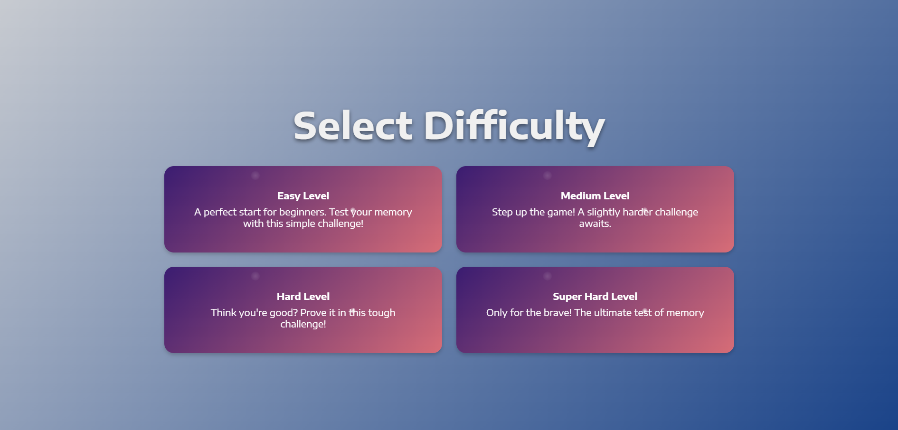

# Memory_Matching_Game 🎮🧠

## Description
Dive into the thrilling world of **Memory Game**, where your mind is the ultimate weapon!  
Challenge your memory skills and reflexes in this engaging card-matching adventure.

## Live Demo 🌐
Try the game live here: [Memory Game](https://github.com/Mado007/Memory_Matching_Game.git)

## Screenshots 📸

## How to Play 🚀

1. **Start the Game**  
   - Click on the "Start" button on the main menu to begin.

2. **Adjust the Sound**  
   - Choose your preferred sound level using the volume slider or sound options.

3. **Select Difficulty Level**  
   - Pick the level of difficulty that suits you:
     - Easy: Fewer cards, suitable for beginners.
     - Medium: Moderate number of cards for casual players.
     - Hard: Large number of cards for a challenging experience.

4. **Start Matching**  
   - Begin the game by clicking on any card to reveal it.  
   - Find and click its matching card.  
   - Repeat until all pairs are matched.  

5. **Win the Game**  
   - Complete the game by matching all cards within the least number of moves and time!

## Features ✨

- **Dynamic Difficulty Levels**  
  Each level offers a unique challenge! From beginner-friendly card sets to advanced layouts that test your memory to the max.

- **Engaging and Energetic Music**  
  The game features carefully selected music tracks that perfectly match the gameplay, keeping you motivated and immersed.

- **Time Tracker for Extra Excitement**  
  A built-in timer adds a competitive edge, encouraging players to beat the clock and improve their skills.

- **Responsive Design**  
  Play seamlessly on any device—mobile, tablet, or desktop.

- **Visually Stunning Cards**  
  Enjoy beautifully designed cards and smooth animations for an engaging experience.

- **Sound Effects and Feedback**  
  Interactive sound effects enhance every move, making the game even more satisfying.

  Get ready to test your memory and enjoy an exciting gaming experience like no other!

## Installation 🛠️

1. Clone the repository:
    
   git clone git@github.com:Mado007/Memory_Matching_Game.git

    Navigate to the project folder:
    cd memory-game

   Open the main-game.html file in your browser:
   start index.html

### **7. Technologies Used**
 
## Technologies Used 🛠️
- **HTML5**: For the game structure.
- **CSS3**: For styling and animations.
- **JavaScript**: For game logic and interactivity.

## Contribution 🤝
We welcome contributions to enhance the game!

### How to Contribute:
1. Fork the repository.
2. Create a new branch for your feature or bug fix:
   
   git checkout -b feature-name

 Commit your changes and push to your branch:
  git push origin feature-name

  Open a Pull Request.

### **9. License** 
## License ⚖️
- This project is licensed under the [MIT License](LICENSE). Feel free to use and modify it, but please give credit where it’s due.